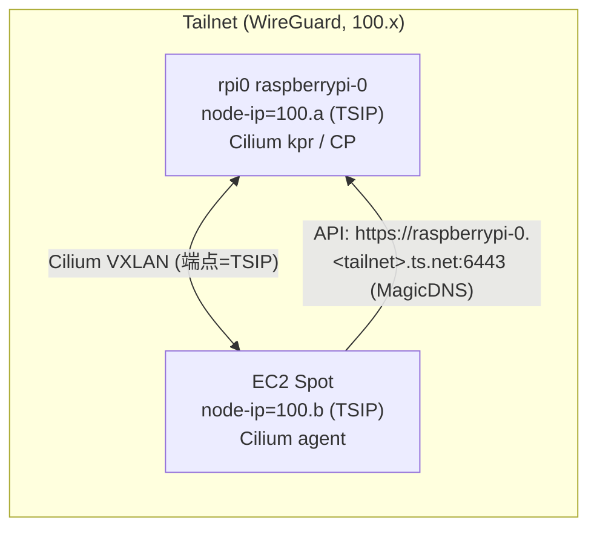

# k3s + Cilium hybrid node (EC2) — Terraform / Terrakube

自宅 LAN の Raspberry Pi(**rpi0 / raspberrypi-0**、CNI=**Cilium** kube-proxy-replacement)の k3s クラスタに、
AWS の EC2 Spot を **Tailscale 純オーバーレイ**で worker node として join する Terraform モジュール。

flannel 版 [`../k3s-hybrid-node`](../k3s-hybrid-node) の Cilium 版。設計上の違いは末尾の比較表を参照。

## 設計（B: 純オーバーレイ / subnet route なし）

- rpi0 も EC2 も **Tailscale ノード**として参加し、**両者の TS IP(100.x) どうしで直接 mesh** する。
- **自宅 LAN(192.0.2.0/24)は tailnet に橋渡ししない**（subnet route を広告しない）。
  → インターネット公開の Spot ノードが侵害されても物理 LAN に踏み込めない。A 案(subnet route)より blast radius が小さい。
- Cilium の VXLAN トンネル端点は各 node の **InternalIP**。両 node の InternalIP を TS IP にすることで、
  トンネルが tailnet(WireGuard)上に乗る。
  - rpi0: k3s に `--node-ip=<rpi0 TSIP>` と `--tls-san=<rpi0 TSIP>` を追加して再起動。
  - EC2: user-data の `k3s agent --node-ip=$TSIP`（本モジュールが自動投入）。



## 前提（このモジュール外・一度きり）

1. **rpi0 を tailnet に参加**させる（subnet route は広告しない）:
   ```bash
   # rpi0 上で
   curl -fsSL https://tailscale.com/install.sh | sh
   sudo tailscale up --accept-dns=false --ssh --hostname=raspberrypi-0
   RPI0_TSIP=$(tailscale ip -4 | head -1)   # 100.x.y.z
   ```
2. **rpi0 の k3s の node-ip を TS IP にする**。node-ip は systemd unit の ExecStart にあるので
   `/etc/systemd/system/k3s.service` の `--node-ip=<LAN IP>` を `--node-ip=<RPI0_TSIP>` に変更
   （config.yaml の node-ip は ExecStart の CLI フラグに上書きされるため効かない）。
   API 証明書 SAN は config.yaml で追加:
   ```yaml
   # /etc/rancher/k3s/config.yaml（既存の disable: [servicelb, traefik] に加えて）
   tls-san:
     - <RPI0_TSIP>                          # tailnet からの API 用
     - 192.0.2.17                        # LAN からの kubectl 用
     - raspberrypi-0.<tailnet>.ts.net       # MagicDNS FQDN（EC2 はこれで接続）
   ```
   ```bash
   sudo systemctl daemon-reload && sudo systemctl restart k3s
   ```
   > 注: `node-ip` を単一 TS IP にすると rpi0 の Cilium トンネル端点が TS IP になり、
   > **以降クラスタに join する全ノード（自宅 Pi 含む）も Tailscale 上にいる必要がある**（純オーバーレイの帰結）。
   > `k3s_cp_host` は **MagicDNS FQDN 推奨**（rpi0 の TS IP が変わっても追従。EC2 は `--accept-dns=true` で解決）。
3. Tailscale 管理コンソールで **EC2 用 auth key** を発行（reusable + ephemeral 推奨）。

## secrets

`k3s_token` と `tailscale_authkey` は **sensitive 変数**。リポジトリにコミットしない（`.gitignore` で `*.tfvars` 除外済み）。

- `k3s_token`: rpi0 で `sudo cat /var/lib/rancher/k3s/server/node-token`
- `tailscale_authkey`: Tailscale 管理コンソール → Settings → Keys → Generate
- `k3s_cp_host`: rpi0 の MagicDNS FQDN `raspberrypi-0.<tailnet>.ts.net`（`sudo tailscale status --json | grep DNSName` で確認）。tfvars か `TF_VAR_k3s_cp_host` で渡す

## ローカル(CLI)での実行

```bash
cd ec2/k3s-cilium-hybrid-node
cp terraform.tfvars.example terraform.tfvars   # k3s_cp_host(rpi0 TSIP) と secrets を追記
AWS_PROFILE=example-env terraform init
AWS_PROFILE=example-env terraform plan
AWS_PROFILE=example-env terraform apply
```

## 検証（join 後）

```bash
# rpi0 上で（EC2 node が Ready、Cilium agent が載る）
sudo k3s kubectl get nodes -o wide
sudo k3s kubectl -n kube-system get pods -l k8s-app=cilium -o wide
# node 間 Cilium 到達性（tunnel 健全性）
sudo k3s kubectl -n kube-system exec ds/cilium -c cilium-agent -- cilium-dbg status --brief
sudo k3s kubectl -n kube-system exec ds/cilium -c cilium-agent -- cilium-dbg bpf tunnel list
```

## 破棄

```bash
AWS_PROFILE=example-env terraform destroy
# k3s 側のノード掃除:
sudo k3s kubectl delete node <node_name>
```

## flannel 版との違い

| 項目 | flannel 版 (`../k3s-hybrid-node`) | Cilium 版 (本モジュール) |
|---|---|---|
| CNI | flannel VXLAN | Cilium kube-proxy-replacement |
| tailnet | subnet route(192.0.2.0/24)経由で CP=.8 | 純オーバーレイ、CP=rpi0 の TS IP |
| EC2 node IP | `--node-external-ip=$TSIP` | `--node-ip=$TSIP` |
| CP 側 | 変更不要（.8 は SAN 済み） | rpi0 に `--node-ip`/`--tls-san` 追加 + 再起動 |
| LAN 露出 | あり（subnet 全体を tailnet へ） | なし（LAN を橋渡ししない） |
| k3s version | v1.31.4+k3s1 | v1.36.2+k3s1 |
| state key | `ec2/k3s-hybrid-node/…` | `ec2/k3s-cilium-hybrid-node/…` |
