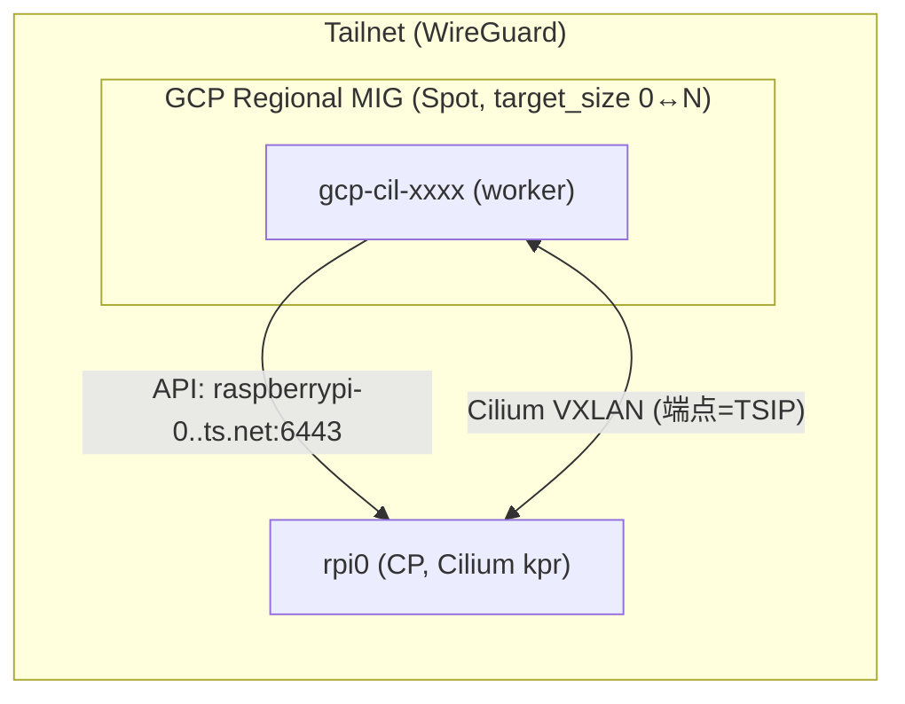

# k3s + Cilium hybrid node (GCP) — Terraform

rpi0(Raspberry Pi, k3s + Cilium kpr, CP)に、**GCP の GCE ノード**を Tailscale 純オーバーレイで worker として join する Terraform モジュール。AWS 版 [`../../ec2/k3s-cilium-hybrid-node`](../../ec2/k3s-cilium-hybrid-node) の GCP 対応。

## 設計（AWS ASG と対をなす autoscaling 構成）

- **Regional MIG（Managed Instance Group）+ Spot** でノードを供給（AWS の ASG+Spot 相当）。複数ゾーン分散。
- **ゼロスケール**: `target_size` を **0** にすればノード 0＝課金ゼロ。`cluster-autoscaler`(GCP provider)を入れれば pending pod で 0↔N 自動増減（`lifecycle.ignore_changes=[target_size]` で TF と競合しない）。テスト時は `target_size=1`。
- **共通 join 規約**: Tailscale 参加 → `--node-ip=<TSIP>` / label `cloud=gcp` / taint `dedicated=gcp-ops:NoSchedule` / CP は MagicDNS FQDN。
- **クラウド操作権限**: VM に SA をアタッチ（default compute SA 可）。ワークロードは Kro `GcpWorkload`(hostNetwork)で metadata 経由の SA を利用＝静的鍵不要（AWS の instance profile 相当）。



## 前提（一度きり）

- rpi0 が tailnet 参加済み・node-ip=TSIP・tls-san に FQDN 追加済み（AWS 版 README 参照）
- Cilium の `KUBERNETES_SERVICE_HOST` が rpi0 の TS IP（tailnet ノードから API 到達に必須）
- GCP: Compute Engine API 有効・billing 有効
- 認証: `gcloud auth application-default login`（google provider 用）＋ `AWS_PROFILE=st-dev`（S3 backend 用）

## secrets

`.gitignore` 済み（`*.tfvars`）。コミットしない。

- `k3s_token`: rpi0 で `sudo cat /var/lib/rancher/k3s/server/node-token`
- `tailscale_authkey`: 管理コンソール（reusable+ephemeral 推奨）。同一 tailnet の既存キー流用可
- `k3s_cp_host`: rpi0 の MagicDNS FQDN

## 実行

```bash
cd gcp/k3s-cilium-hybrid-node
cp terraform.tfvars.example terraform.tfvars   # secrets と k3s_cp_host を記入
AWS_PROFILE=st-dev terraform init
AWS_PROFILE=st-dev terraform plan
AWS_PROFILE=st-dev terraform apply
```

## 検証

```bash
# rpi0 上で
sudo k3s kubectl get nodes -l cloud=gcp -o wide     # Ready
# Kro GcpWorkload を投入 → この GCP ノードに載って metadata で SA 利用
sudo k3s kubectl apply -f ../../kro/base/instance-gcp-workload-example.yaml
```

## ゼロスケール

- 手動: `target_size=0` にして apply（or MIG を 0 に）→ ノード 0・課金 0。
- 自動: `cluster-autoscaler --cloud-provider=gce` を rpi0 に配置し、この MIG を min=0/max=N で登録。pending の `cloud=gcp` pod で起動、idle で 0。**k3s でも動作**（CA は cloud の control-plane 非依存、GCP の MIG API を叩くだけ）。※ k3s ノードは providerID 未設定なので CA の node group discovery 設定に注意。

## 破棄

```bash
AWS_PROFILE=st-dev terraform destroy
# k3s 側:
sudo k3s kubectl delete node <node_name>
```

## AWS 版との対応

| 項目 | AWS (`ec2/...`) | GCP (本モジュール) |
|---|---|---|
| ノード供給 | ASG + Mixed Instances Spot | Regional MIG + Spot |
| ゼロスケール | min=0（CA） | target_size=0（CA） |
| 権限 | IAM instance profile(IMDS) | SA(metadata) |
| state | `ec2/k3s-cilium-hybrid-node/…` | `gcp/k3s-cilium-hybrid-node/…` |
